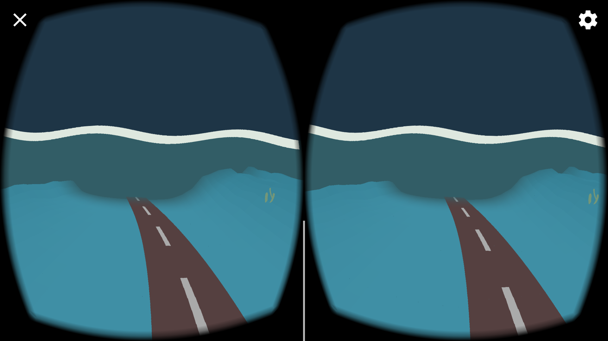
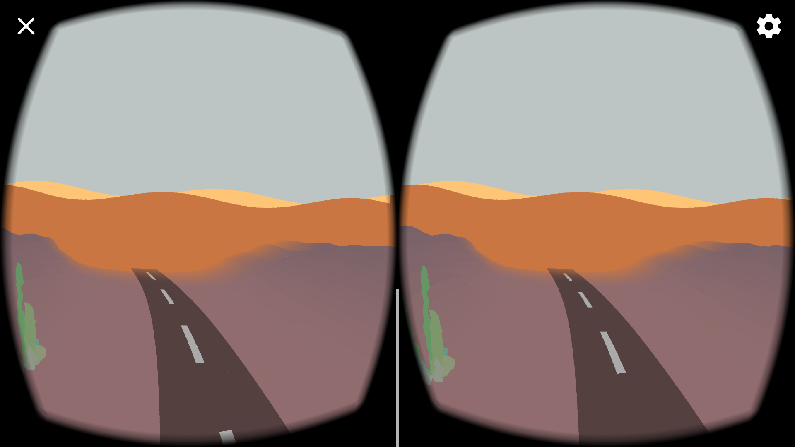
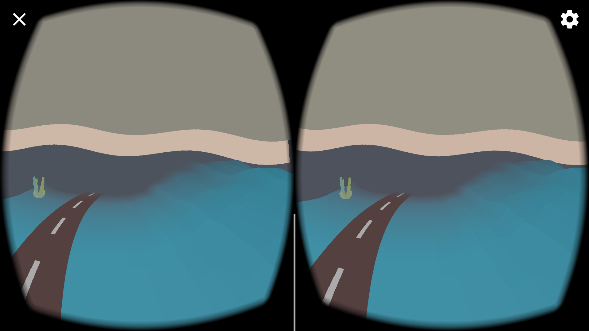
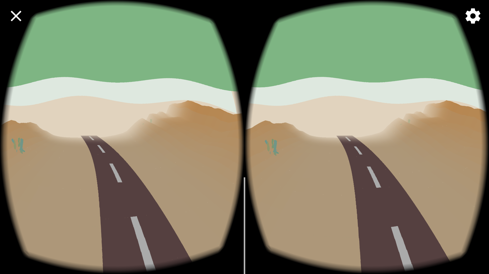

<h1>VR Audioscape</h1>

Google Summer of Code 2017 project: VR application built with <a href="https://github.com/processing/processing-android">processing-android</a>.

made with ♥ by <a href="https://picorana.github.io">picorana</a>

  

 

VR Audioscape is a VR application made with Processing.
It lets you travel through a procedural landscape generated according to music. Play any music from any app on your phone, then run the app: it will automatically use as input any sound coming as output from the phone.

## Table of contents
- [Download](#download)
- [Usage](#usage)
- [Screenshots](#screenshots)
- [Compiling Instructions](#how-to-compile-the-app-from-source)
- [Target](#target)
- [Project Timeline](#summer-of-code-timeline)
- [Acknowledgements](#acknowledgements)
- [Links](#links)

## Download
- Download the app from the play store: [VR audioscape on Google Play](https://play.google.com/store/apps/details?id=com.picorana.vraudioscape)
- Or dowload the .apk from  this repository: [.apk ](https://github.com/picorana/VR_Demo_GSoC17/blob/master/Desert_Road/build/desert_road_release_signed_aligned.apk)

## Usage
After installing the app, open any other app on your phone that is capable of playing music. Play a track of your choice, then open VR audioscape.

If music is detected correctly, the start scene will show lines representing the music being played. Look for the button that says *'Look here to start'*, stare at it for three seconds, and the app will start, showing the actual landscape scene.

## Screenshots
<table style="width:100%">
 <tr>
   <td></td>
   <td></td>
 </tr>
 <tr>
   <td></td>
   <td></td>
 </tr>
</table>

## How to compile the app from source
* Download Processing from https://processing.org/
* Make sure you have *Android Mode* installed. If you don't, install it via selecting the *Add Mode...* from the menu in the upper-right corner of the PDE
* Clone the repository on your pc
* Open Desert_Road.pde with Processing
* Connect your phone to your pc, [enable USB debugging](https://developer.android.com/studio/run/device.html#setting-up) on your phone
* Use Processing IDE to compile the sketch on your phone. Instructions to compile an android app via Processing IDE can be found here: [Getting started with Processing for Android](http://android.processing.org/tutorials/getting_started/index.html)

Requirements for compiling the sketch:
* Processing
* [Android Mode 262+](https://github.com/processing/processing-android/releases)

## Target
This app is a proof of concept, meant to test and show what can be made with processing-android in VR.

## Summer of Code Timeline
* Before the start of the coding period:
    - Became familiar with the environment.
    - Discussed possible outcomes and details of the project with the mentors.
* June 2017:
    - Made three possible sketches of how the app would be. The design attempts can be found in this repository, in the branch *old_sketches*. Each sketch examined a different approach at what could best fit the purpose of the project.
    - The sketch we chose at the end of this design phase had a procedural, infinite terrain. I spent the rest of the month refining the terrain, created a road and some procedural cactus.
* July 2017:
    - Implemented reactivity to music. The musical input is taken from Android's Visualizer API. Every sound played from the phone is caught, and then processed through FFT transform and beat detection.
    - Made the terrain generation influenced by music. Now the dunes are based on volume and frequency of the music.
    - Modeled some more cacti.
    - Made the sky and
* August 2017:
    - Made an introductive start screen.
    - Implemented day/night/cycle.
    - Various bug fixes.
    - Uploaded the app on the play store.

## Acknowledgements
Many thanks to [Andres Colubri](https://github.com/codeanticode) and [Gottfried Haider](https://github.com/gohai), who have been my mentors during the project, who put up with my messy code and made this possible.

Thanks to [dasaki's adaptation of minim fft classes to make them work on Android](https://github.com/dasaki/android_fft_minim) and [kctess5's beat detection sketch](https://github.com/kctess5/Processing-Beat-Detection), whose work is used in this project.

## Links:
* [Google Summer of Code](https://summerofcode.withgoogle.com/)
* [Processing for Android](http://android.processing.org/index.html)
